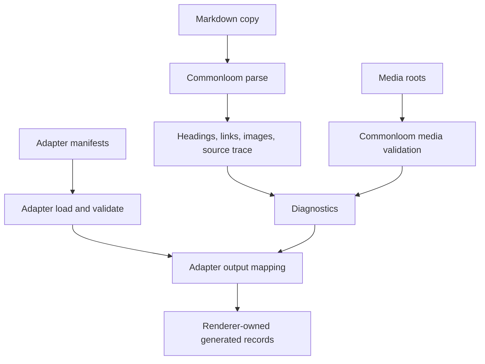

# Commonloom Architecture

Commonloom is the reusable core in a two-layer content pipeline:

1. Commonloom compiles source content into normalized records and diagnostics.
2. A consuming adapter maps those records into framework-specific outputs.

## Boundary

| Layer | Owns | Must Avoid |
| --- | --- | --- |
| Commonloom core | Markdown, frontmatter, HTML policy, links, media, diagnostics, source traces, normalized records. | Svelte, product data, route registries, renderer-specific modules. |
| Adapter | route ids, page groups, manifests, wiki-link policy, generated TypeScript formatting, renderer compatibility. | Generic parsing behavior that belongs in Commonloom. |

## Pipeline Shape

## Source Trace

Source traces should preserve enough information to make generated records
reviewable:

- Markdown source path
- manifest path when present
- content hash
- heading ids and labels
- extracted links
- extracted images
- line and column positions where available

## Safety Model

Commonloom should report diagnostics instead of silently accepting unsafe or
missing content. Important diagnostic families include invalid frontmatter,
unsafe HTML, unresolved links, unresolved media, missing alt text, and path
traversal.

## Local Package Layout

| Path | Responsibility |
| --- | --- |
| `src/compiler.ts` | Commonloom compiler entrypoint. |
| `src/frontmatter.ts` | YAML frontmatter parsing and validation. |
| `src/markdown.ts` | CommonMark and GFM parsing plus heading extraction. |
| `src/html.ts` | Safe static HTML rendering and unsafe HTML diagnostics. |
| `src/links.ts` | Markdown link, image, and wiki-link reference extraction. |
| `src/media.ts` | Local media reference validation. |
| `src/paths.ts` | Root-confined path resolution. |
| `src/source-trace.ts` | Content hash, heading, link, and image source traces. |
| `src/types.ts` | Public Commonloom contracts. |
| `test/` | Unit, integration, end-to-end, and security tests for Commonloom behavior. |

> [!WARNING] Adapter Drift
> If route ids, renderer shapes, or generated TypeScript formatting leak into
> Commonloom, the extraction stops being reusable and becomes a relocated
> application-specific implementation detail.

## Evidence

- [[sources/flavor-grenade-lsp/website/docs/architecture/content-pipeline|content-pipeline architecture]]
- [[sources/flavor-grenade-lsp/website/docs/adr/0002-use-page-group-markdown-manifests-for-website-copy|ADR 0002]]
- [[sources/flavor-grenade-lsp/docs/plans/phase-W8-commonloom-content-pipeline|Phase W8 plan]]
- [[plans/phase-1-import-commonloom-package|Phase 1 import plan]]

## See Also

- [[Commonloom]]
- [[Commonloom Requirements]]
- [[adr|Commonloom ADRs]]
