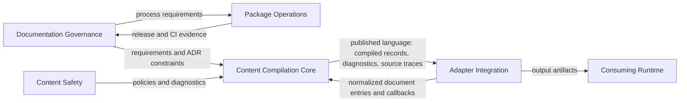

# Commonloom Context Map

## Map

## Relationships

| Upstream Context | Downstream Context | Relationship | Contract |
| --- | --- | --- | --- |
| Content Compilation Core | Adapter Integration | Published language | Public types for compiled records, diagnostics, source traces, headings, links, images, and content hashes. |
| Adapter Integration | Content Compilation Core | Customer-supplier | Adapters supply normalized entries, schema validators, wiki-link callbacks, approved roots, and output needs. |
| Content Safety | Content Compilation Core | Partnership | Safety policies are enforced during compilation and represented as diagnostics. |
| Documentation Governance | Content Compilation Core | Policy source | ADRs and requirements constrain durable behavior until superseded. |
| Package Operations | Documentation Governance | Evidence provider | CI, release, and ticket evidence prove operational requirements. |
| Adapter Integration | Consuming Runtime | Anti-corruption layer | Adapters translate Commonloom records into framework-specific renderer data. |

## Integration Styles

### Published Language

Commonloom should publish a stable language through public TypeScript types:

- compiled records
- diagnostic codes and severities
- source traces
- heading, link, and image references
- document entry inputs
- result objects

### Anti-Corruption Layer

Adapters protect Commonloom from project-specific concepts:

- route registries
- product copy modules
- Svelte or other framework components
- generated TypeScript formatting
- renderer compatibility records
- bundler asset imports

### Policy Injection

Safety and validation behavior enters through explicit options or callbacks:

- HTML policy
- frontmatter schema validation
- manifest schema validation
- wiki-link resolution
- approved media roots
- decorative image policy

## See Also

- [[bounded-contexts|Bounded Contexts]]
- [[tactical-model|Tactical Model]]
- [[adr/0002-use-page-group-manifests-as-adapter-inputs|ADR 0002]]
